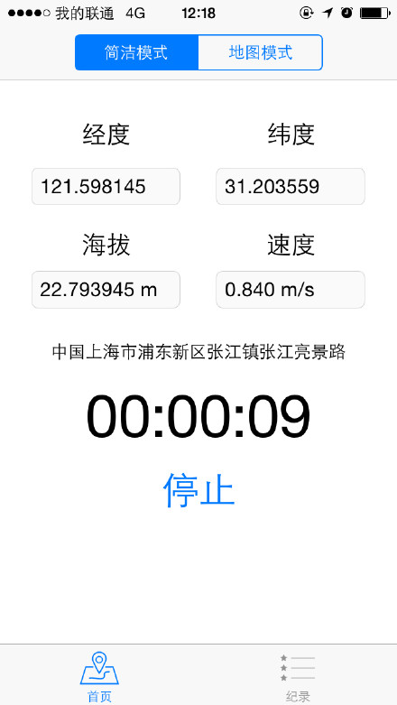
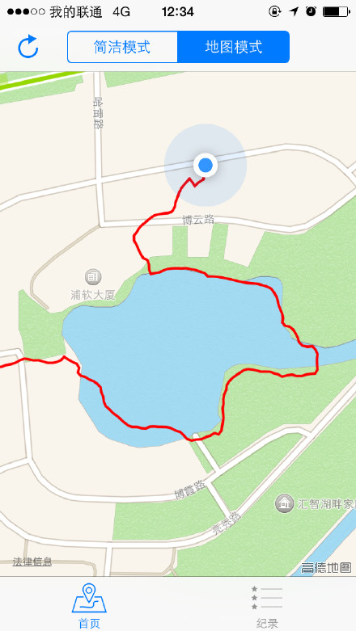
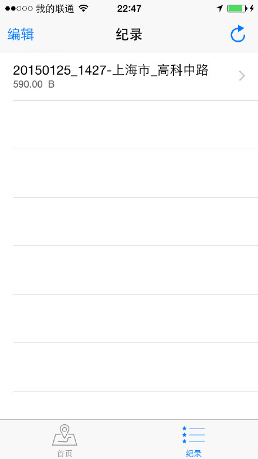
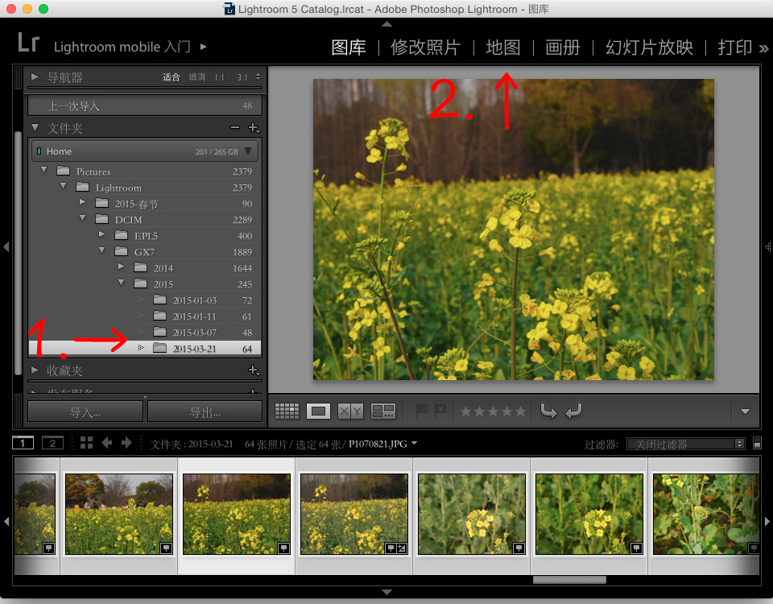
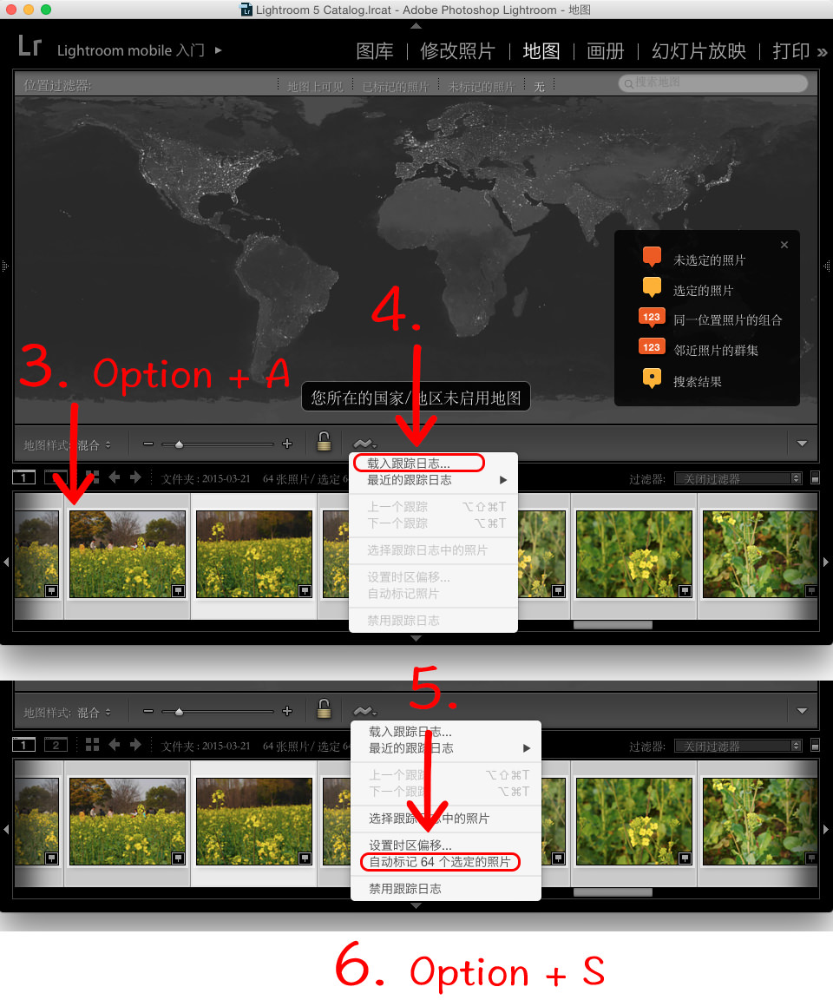

# GPSRecorder
- ### Record user's tracks with iPhone, and store it in a GPX file, user can export them with iTunes. Adobe Lightroom Or Aperture can write gps data in photo's Exif;

- ### How to use Lightroom import gps data into photos.

